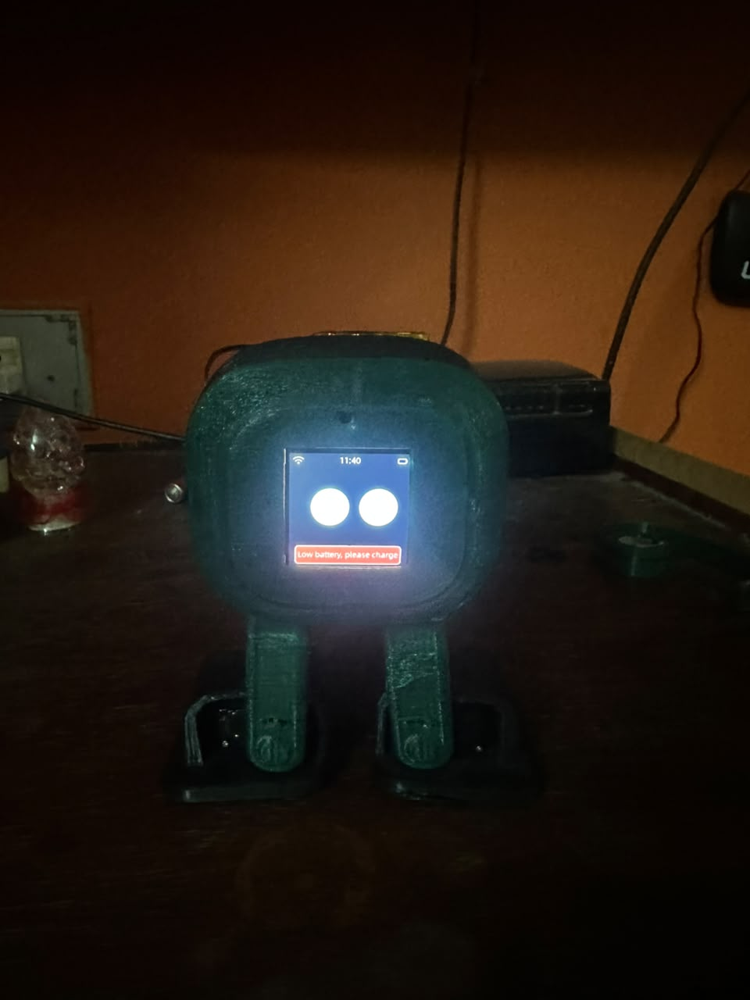
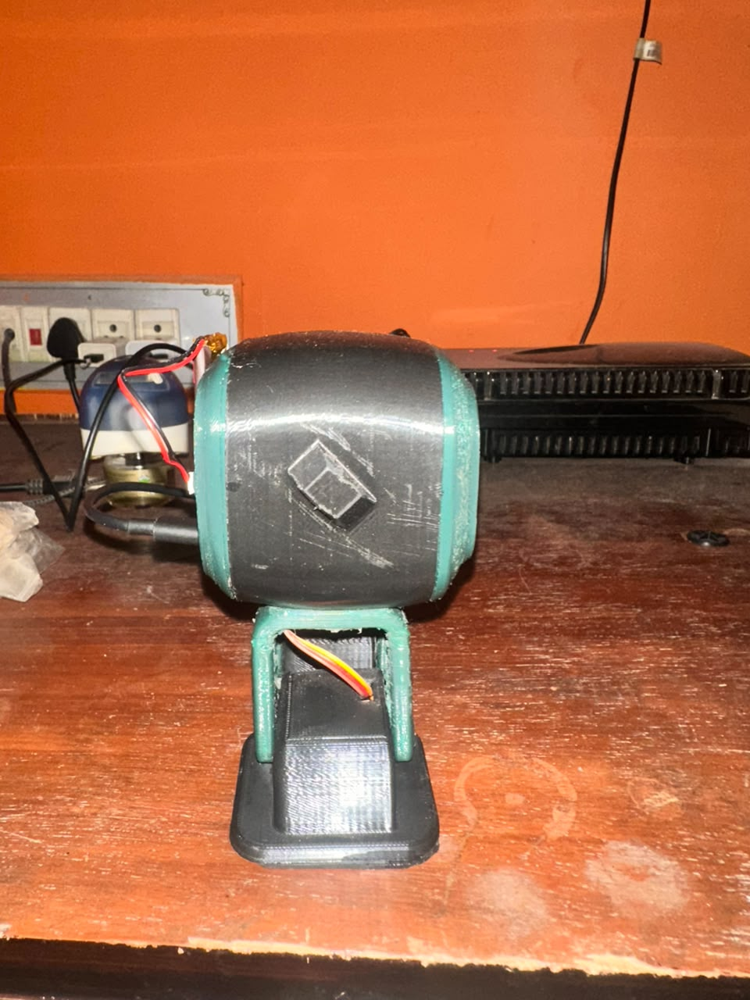
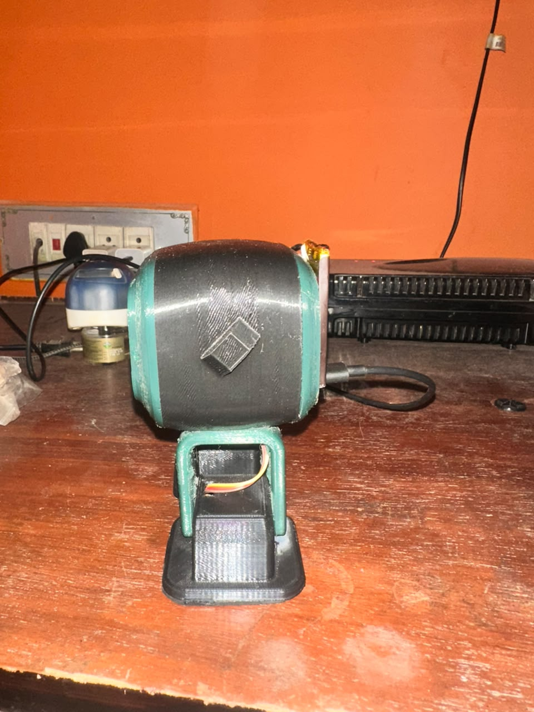
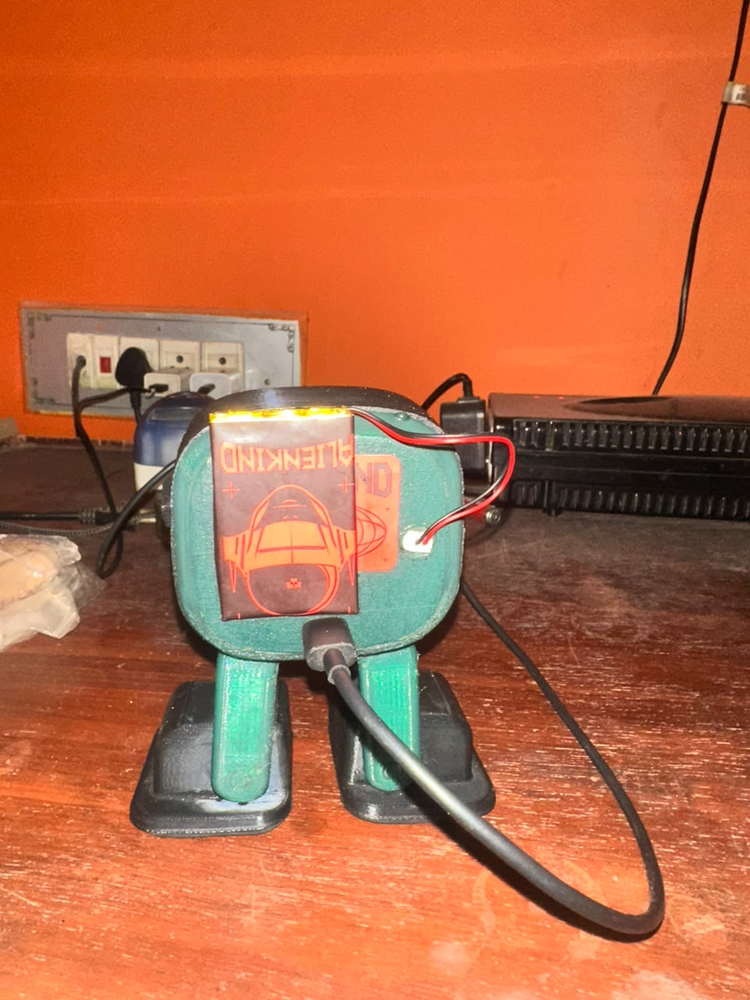

# 🤖 Jarvis AI Biped Robot

An ESP32-S3 powered AI biped robot featuring voice conversations, long-term memory, web search, MCP tools, real-time information retrieval, and an intelligent companion personality.

---

## 📸 Project Gallery

### Front View

### Left Side

### Right Side

### Rear View

---

## 🎯 Project Goal

Jarvis is an ESP32-S3 powered autonomous biped robot designed to combine robotics, artificial intelligence, voice interaction, memory, and real-time information retrieval into a single companion platform.

Unlike traditional hobby robots, Jarvis can hold conversations, remember information, retrieve current information from the internet, and assist with engineering projects through custom MCP tools.

---

## 🚀 Features

- Voice Interaction
- Long-Term Memory
- Web Search Integration
- AI News Retrieval
- Robotics News Retrieval
- Weather Information
- MCP Tool Integration
- Project Assistant
- Custom Personality
- Biped Robot Motion

---

## 🔧 Hardware

- ESP32-S3 N16R8
- SH1106 OLED Display
- MPU6050 IMU
- VL53L0X ToF Sensor
- INMP441 Microphone
- MAX98357A Audio Amplifier
- 4 Servo Motors
- Lithium Battery
- Charging Module

---

## 🏗 System Architecture

User
↓
Microphone
↓
ESP32-S3
↓
Xiaozhi / Tenclass
↓
Language Model
↓
MCP Server
├── Memory
├── Web Search
├── AI News
├── Robotics News
├── Weather
└── Project Assistant
↓
Speaker

---

## 🛠 MCP Tools

- robot_status()
- wikipedia_search()
- web_search()
- latest_ai_news()
- robotics_news()
- weather()
- remember()
- recall()
- daily_briefing()
- project_status()
- troubleshooting_help()

---

## 🎥 Demo

Demo video available in:

media/Robot.mp4

---

## 📈 Future Roadmap

- [ ] Vision System
- [ ] Face Recognition
- [ ] Object Detection
- [ ] Autonomous Navigation
- [ ] Device Control
- [ ] Smart Home Integration
- [ ] Music Streaming
- [ ] Self-Charging Dock

---

## 🙏 Credits

This project is based on the open-source Xiaozhi ESP32 firmware and extended with custom MCP tools, memory features, web search capabilities, and robotic companion functionality.

---

## 👨‍💻 Author

Chiranthan Shetty

Bangalore, India

Robotics • AI • Embedded Systems • IoT
